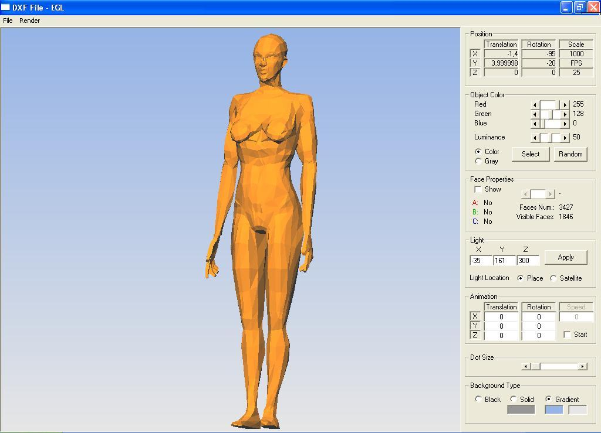



## EGL\_dxf version

### Description

computer graphics and 3d programming tutorial.No DirectX or OpenGL. Matrix math , Lighting ,

Culling , Z order function , Open ".prt" file , quick frame rate (20~400 FPS), animation ,

various render options , luminance , only pure windows api use. smooth rendering,change

background color, fixed bug (translate z axis etc.),dot size. aditional properties gradient

background and open dxf (simple) :) 258 kb. zip
 
### More Info
 

             |
---                |---
**Submitted On**   |2007-07-17 21:55:20
**By**             |[Erkan Sanli](https://github.com/Planet-Source-Code/PSCIndex/blob/master/ByAuthor/erkan-sanli.md)
**Level**          |Intermediate
**User Rating**    |5.0 (99 globes from 20 users)
**Compatibility**  |VB 4\.0 \(32\-bit\), VB 5\.0, VB 6\.0
**Category**       |[Graphics](https://github.com/Planet-Source-Code/PSCIndex/blob/master/ByCategory/graphics__1-46.md)
**World**          |[Visual Basic](https://github.com/Planet-Source-Code/PSCIndex/blob/master/ByWorld/visual-basic.md)
**Archive File**   |[EGL\_dxf\_ve2076257192007\.zip](https://github.com/Planet-Source-Code/erkan-sanli-egl-dxf-version__1-68916/archive/master.zip)

